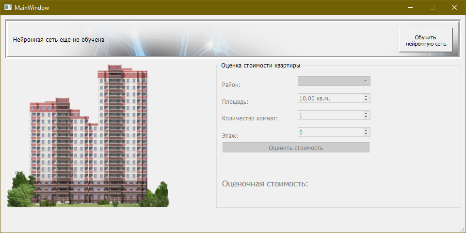
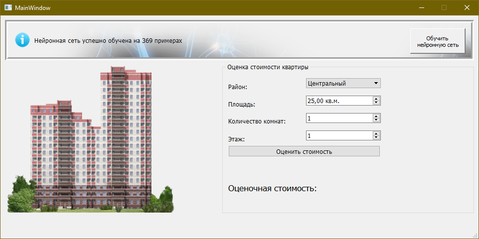
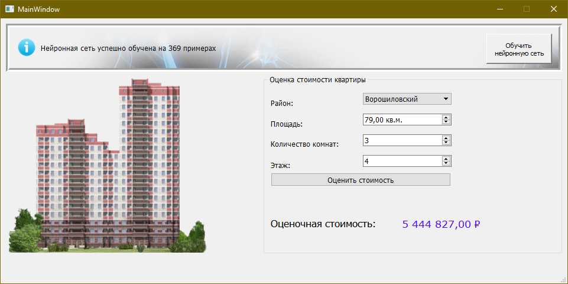

# AI Flat Price

Программа расчета стоимости недвижимости с помощью нейронной сети.

Характеристики:
- район
- площадь
- количество комнат
- этаж

[Обучающая выборка](data/volgograd_new_flats_2015.xls): 369 квартир в новостройках, данные за 2015 год из открытых источников.  
Обучающий алгоритм: [L-BFGS](https://en.wikipedia.org/wiki/Limited-memory_BFGS).  
  
Проект написан на языке C++ в учебных целях. Скомпилирован в Visual Studio 2013. Platform Toolset v120. Дополнительно используется Qt 5.5.0, [Alglib 3.10.0](https://www.alglib.net/), [BasicExcel](https://www.codeproject.com/Articles/13852/BasicExcel-A-Class-to-Read-and-Write-to-Microsoft).

